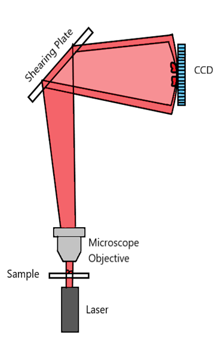
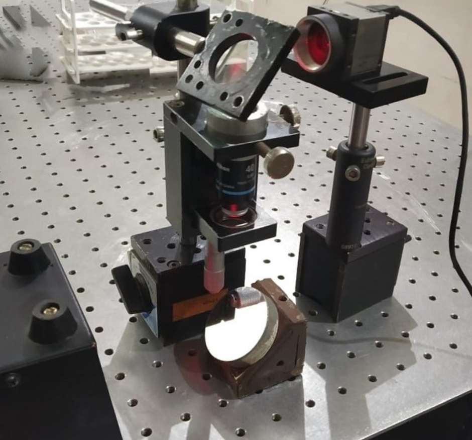
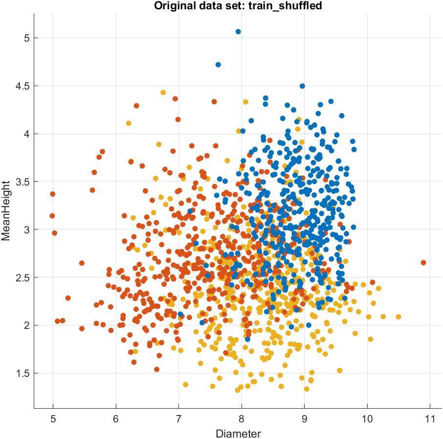
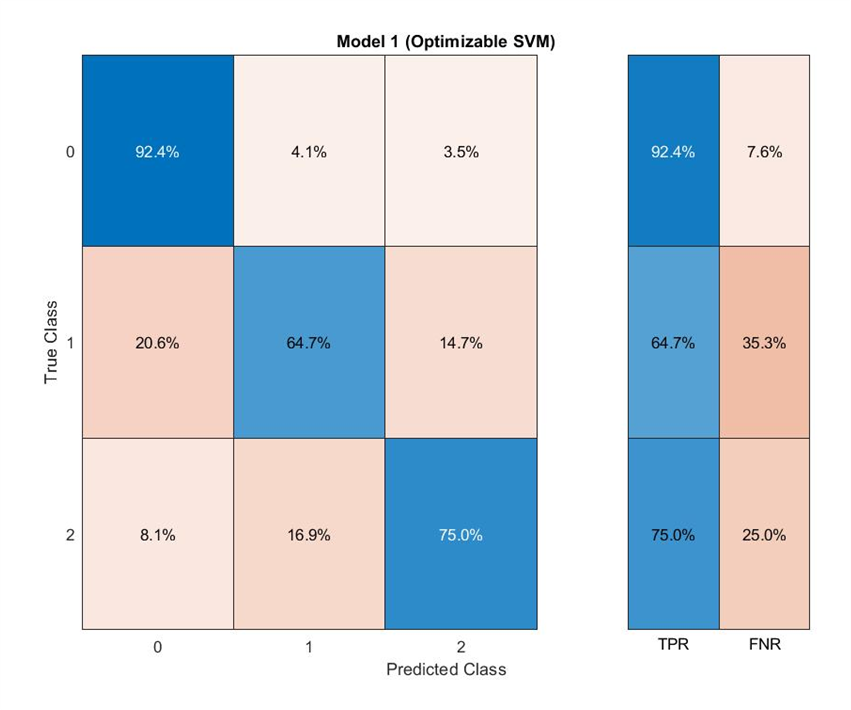
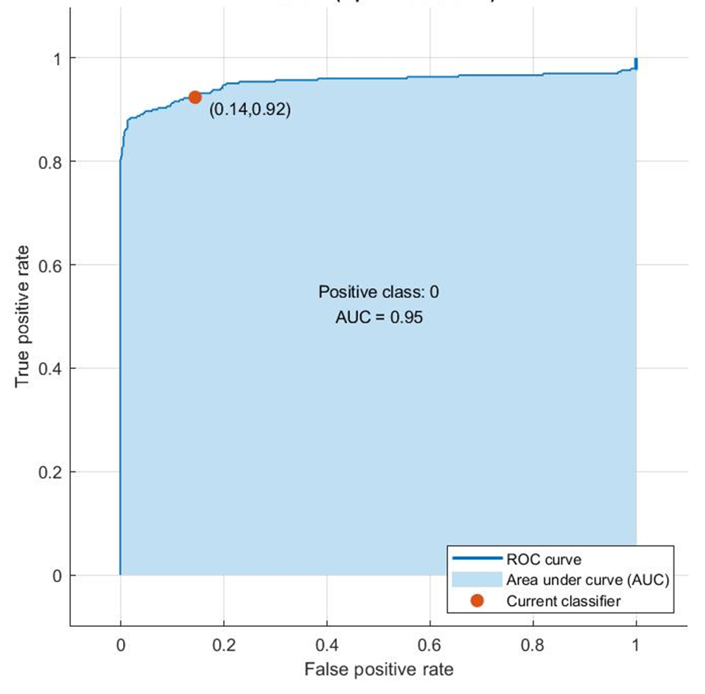

---

# Cell Characterization using Digital Holographic Microscopy and Machine Learning

## Overview

This project presents a **data-driven approach to biomedical cell analysis** using **Digital Holographic Microscopy (DHM)** combined with **Machine Learning**. The goal is to classify **healthy and diseased red blood cells (RBCs)** based on their **morphological and mechanical properties** extracted from holographic imaging data.

The workflow integrates:

* Optical data acquisition
* Signal processing and numerical reconstruction
* Feature engineering from biological structures
* Supervised machine learning classification

The project demonstrates how **physical imaging data can be transformed into structured datasets and analyzed using ML algorithms** to detect disease-related patterns.

---

### Project Resources

📄 **Project Report:**  
[View Full Dissertation](./docs/final.pdf)

📊 **Project Presentation:**  
[View Presentation Slides](./docs/final.pptx)

---

# Project Objectives

1. Capture holographic images of human red blood cells using **Lateral Shearing Interferometry**.
2. Reconstruct **phase and thickness profiles** from holograms.
3. Extract **biophysical and biomechanical features** from the reconstructed data.
4. Build a **machine learning classification model** to distinguish between:

   * Healthy RBCs
   * Sickle Cell Disease
   * Thalassemia
5. Evaluate model performance using standard **ML metrics**.

---

# Project Architecture

```
Microscope Imaging
        │
        ▼
Hologram Acquisition
        │
        ▼
Numerical Reconstruction (FFT / MATLAB)
        │
        ▼
Thickness & Phase Profile Extraction
        │
        ▼
Feature Engineering
        │
        ▼
Dataset Creation
        │
        ▼
Machine Learning Model (SVM)
        │
        ▼
Classification & Evaluation
```

---

# Digital Holographic Microscopy

Digital Holographic Microscopy is an imaging technique that records **both amplitude and phase information of light waves** scattered from microscopic objects.

Unlike traditional microscopy, DHM allows:

* Quantitative phase imaging
* Nanometer-scale thickness measurement
* 3D morphological reconstruction

## Advantages

| Feature                  | Description                                          |
| ------------------------ | ---------------------------------------------------- |
| Non-invasive             | No staining required                                 |
| High sensitivity         | Nanometer level phase resolution                     |
| Quantitative             | Enables direct measurement of cell morphology        |
| Real-time reconstruction | Numerical reconstruction using computational methods |

---

# Experimental Setup

The imaging system consists of the following components:

| Component                       | Function                                  |
| ------------------------------- | ----------------------------------------- |
| He-Ne Laser                     | Coherent illumination source              |
| Microscope Objective            | Magnifies biological sample               |
| Lateral Shearing Interferometer | Generates interference hologram           |
| CCD Camera                      | Captures holographic interference pattern |
| Computer                        | Performs numerical reconstruction         |

## Experimental Setup Diagram





---

# Dataset

### Samples Collected

| Sample Type         | Number of Samples |
| ------------------- | ----------------- |
| Healthy RBC         | 500               |
| Thalassemia         | 500               |
| Sickle Cell Disease | 500               |

Total cells analyzed:

```
1432 Red Blood Cells
```

Each cell was extracted from holographic recordings and converted into numerical features.

---

# Data Processing Pipeline

## Step 1: Hologram Recording

* Blood smear prepared
* Imaging conducted at **40x magnification**
* Holograms recorded for **20 seconds at 15 fps**

## Step 2: Numerical Reconstruction

Using **Fourier Transform based reconstruction**:

* Angular spectrum propagation
* Phase extraction
* Noise reduction via reference hologram subtraction

## Step 3: Thickness Estimation

Thickness calculated using:

```
Optical Path Length = (n_cell − n_medium) × thickness
```

Where:

| Parameter                 | Value |
| ------------------------- | ----- |
| Refractive Index (RBC)    | 1.42  |
| Refractive Index (Plasma) | 1.34  |

---

# Feature Engineering

From reconstructed thickness profiles, multiple **biophysical and biomechanical features** were extracted.

## Extracted Features

| Feature Category | Features                          |
| ---------------- | --------------------------------- |
| Physical         | Diameter, Thickness, Area, Volume |
| Shape Metrics    | Eccentricity, Sphericity          |
| Optical          | Optical Path Length               |
| Statistical      | Skewness, Kurtosis                |
| Mechanical       | Membrane Stiffness                |
| Dynamic          | Volume Fluctuation                |
| Motion           | Lateral Oscillation               |
| Frequency        | Membrane Frequency Fluctuation    |

These features were combined into a structured dataset for machine learning.

---

# Machine Learning Model

## Algorithm Used

Support Vector Machine (SVM)

SVM was chosen because:

* Effective in high-dimensional spaces
* Robust to small datasets
* Works well for non-linear classification with kernels

## Classification Targets

| Label | Class       |
| ----- | ----------- |
| 0     | Healthy RBC |
| 1     | Sickle Cell |
| 2     | Thalassemia |

---



# Training Pipeline

```
Feature Dataset
       │
       ▼
Train / Test Split
       │
       ▼
SVM Model Training
       │
       ▼
Hyperplane Generation
       │
       ▼
Prediction on Test Data
       │
       ▼
Model Evaluation
```

---

# Model Evaluation

## Binary Classification (Healthy vs Diseased)

| Metric                 | Value   |
| ---------------------- | ------- |
| Sensitivity (Healthy)  | 92.4%   |
| Sensitivity (Diseased) | 85.6%   |
| Overall Accuracy       | **89%** |

---

## Multi-Class Classification

| Class       | Accuracy |
| ----------- | -------- |
| Healthy     | High     |
| Sickle Cell | Moderate |
| Thalassemia | Moderate |

Overall classification accuracy:

```
77.3%
```

---

# Evaluation Metrics

### Confusion Matrix



---

### ROC Curve



---

# Key Insights

* Digital holographic imaging enables **quantitative cell morphology analysis**
* Physical and mechanical properties of RBCs differ significantly between diseases
* Machine learning can successfully classify cells based on these features
* Even with a small dataset, the model achieved **89% binary classification accuracy**

---

# Tools and Technologies

| Category         | Tools                                |
| ---------------- | ------------------------------------ |
| Programming      | MATLAB                               |
| Data Processing  | Fourier Transform, Signal Processing |
| Machine Learning | Support Vector Machine               |
| Imaging          | Digital Holographic Microscopy       |
| Data Analysis    | Statistical Feature Extraction       |

---

# Future Improvements

Potential improvements include:

* Increase dataset size for better model generalization
* Use **deep learning models** such as CNNs for direct image classification
* Automate feature extraction pipeline
* Develop real-time diagnostic systems
* Integrate with clinical imaging workflows

---

# Research Applications

This approach can be extended to:

* Automated blood diagnostics
* Disease screening systems
* Cellular biomechanics research
* Label-free biomedical imaging
* AI-assisted medical diagnostics

---

# References

1. Kim, M.K. *Principles and Techniques of Digital Holographic Microscopy*. Journal of Photonics for Energy.
2. Hariharan, P. *Basics of Holography*. Cambridge University Press.
3. Boss et al. *Measurement of Absolute Cell Volume Using Digital Holographic Microscopy*. Journal of Biomedical Optics.
4. Singh et al. *Lateral Shearing Digital Holographic Imaging of Biological Specimens*. Optics Express.
5. Cristianini & Shawe-Taylor. *Introduction to Support Vector Machines*. Cambridge University Press.

---

# Author

**Daksh Patel**
* M.Sc. Applied Physics
* The Maharaja Sayajirao University of Baroda

---